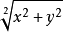
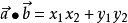
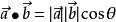
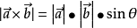
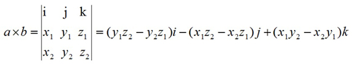
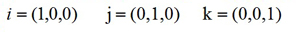
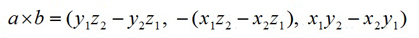
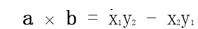

移动端已经为我们提供了`touchstart`,`touchmove`,`touchcancel`和`touchend`四个原生触摸事件。但一般情况下很少直接用到这几个事件，诸如长按事件等都需要自己去实现。不少开源的项目也实现了这些功能，如[zepto的Touch模块](http://zeptojs.com/#touch)以及[hammer.js](http://hammerjs.github.io/)。本文将一步讲解常见移动端事件和手势的实现思路和实现方法，封装一个简单的移动端手势库。

### 常见的事件和手势

`tap`: 单击事件，类似`click`事件和原生的`touchstart`事件，或者触发时间上介于这两个事件之间的事件。

`longtap`： 长按事件，手指按下停留一段时间后触发，常见的如长按图片保存。

`dbtap`: 双击事件，手指快速点击两次，常见的如双击图片方法缩小。

`move/drag`: 滑动/拖动手势，指手指按下后并移动手指不抬起，类似原生的`touchmove`事件，常见如移动iphone手机的AssistiveTouch。

`swipe(Right/Left/Up/Down)`：也是滑动手势，与move不同的是事件触发于move后手指抬起后并满足一定大小的移动距离。按照方向不同可划分为`swipeLeft`,`swipeRight`,`swipeUp`和`swipeDown`。

`pinch/zoom`：手指捏合，缩放手势，指两个手指做捏合和放大的手势，常见于放大和缩小图片。

`rotate`: 旋转手势，指两个手指做旋转动作势，一般用于图片的旋转操作。


### 需求

知道以上的常见事件和手势后，我们最后实现的手势库需要满足以下需求

+ 实现上述所有的事件和手势
+ 保留原生的四个基本的事件的回调
+ 支持链式调用
+ 同一个事件和手势支持多个处理回调
+ 支持事件委托
+ 不依赖第三方库

### 实现思路和代码

#### 1. 基本的代码结构

  库的名称这里命名为**Gesture**,在`windows`暴露的名称为**GT**。以下为基本的代码结构
 
```javascript
;(function(){
	function Gesture(target){
		//初始化代码
	}
    Gesture.prototype = {//实现的代码}
	Gesture.prototype.constructor = Gesture;
	if (typeof module !== 'undefined' && typeof exports === 'object') {
	    module.exports = Gesture;
	 } else if (typeof define === 'function' && define.amd) {
	    define(function() { return Gesture; });
	 } else {
	    window.GT = Gesture;
	 }
})()

```
其中，`target`为实例化时绑定的目标元素，支持传入字符串和HTML元素

 #### 2. 构造函数的实现

构造函数需要处理的事情包括： 获取目标元素，初始化配置和其他需要使用到参数，以及基本事件的绑定，这里除了需要注意一下`this`对象的指向外，其他都比较简单，基本代码如下：

```javascript
  function Gesture(target) {
    this.target = target instanceof HTMLElement ? target : typeof target === "string" ? document.querySelector(target) : null; //获取目标元素
    if(!this.target) return ; //获取不到则不实例化
	//这里要实例化一些参数，后面需要用到哪些参数代码都往这里放
	//...

	//绑定基本事件，需要注意this的指向，事件的处理方法均在prototype实现
    this.target.addEventListener('touchstart',this._touch.bind(this),false);
    this.target.addEventListener('touchmove',this._move.bind(this),false);
    this.target.addEventListener('touchend',this._end.bind(this),false);
    this.target.addEventListener('touchcancel',this._cancel.bind(this),false);
  }

```

下面的内容重点放在`prototype`的实现，分别实现`_touch`,`_move`,`_end`和`_cancel`。

#### 单手指事件和手势

单手指事件和手势包括：`tap`,`dbtap`,`longtap`,`slide/move/drag`和`swipe`。

+ **思路**

当手指开始触摸时，触发原生的`touchstart`事件，获取手指相关的参数，基于需求，此时应该执行原生的`touchstart`回调，这是第一步；接着应该发生以下几种情况：

(1) 手指没有离开并没有移动（或者移动极小的一段距离）持续一段时间后（这里设置为800ms）,应该触发`longtap`事件；

(2) 手指没有离开并且做不定时的移动操作，此时应该先触发原生的`touchmove`事件的回调，接着触发自定义的滑动事件（这里命名为`slide`）,与此同时，应该取消`longtap`事件的触发;

(3) 手指离开了屏幕，开始应该触发原生的`touchend`事件回调，同时取消`longtap`事件触发，在一定时间内（这里设置300ms）离开后手指的距离变化在一定范围外（这里设置为30px），则触发`swipe`手势的回调，否则，如果手指没有再次放下，则应该触发`tap`事件，若手指再次放下并抬起，则应该触发`dbtap`事件，同时应该取消`tap`事件的触发

+ **代码实现**

首先往构造函数添加以下参数:

```javascript

this.touch = {};//记录刚触摸的手指
this.movetouch = {};//记录移动过程中变化的手指参数
this.pretouch = {};//由于会涉及到双击，需要一个记录上一次触摸的对象
this.longTapTimeout = null;//用于触发长按的定时器
this.tapTimeout = null;//用于触发点击的定时器
this.doubleTap = false;//用于记录是否执行双击的定时器
this.handles = {};//用于存放回调函数的对象

```

以下为实现上面思路的代码和说明：

```javascript

_touch: function(e){
      this.params.event = e;//记录触摸时的事件对象,params为回调时的传参
      this.e = e.target; //触摸的具体元素
      var point = e.touches ? e.touches[0] : e;//获得触摸参数
      var now = Date.now(); //当前的时间
	  //记录手指位置等参数
      this.touch.startX = point.pageX; 
      this.touch.startY = point.pageY;
      this.touch.startTime = now;
	  //由于会有多次触摸的情况，单击事件和双击针对单次触摸，故先清空定时器
      this.longTapTimeout && clearTimeout(this.longTapTimeout);
      this.tapTimeout && clearTimeout(this.tapTimeout);
      this._emit('touch'); //执行原生的touchstart回调，_emit为执行的方法，后面定义
      if(e.touches.length > 1) {
        //这里为处理多个手指触摸的情况
      } else {
        var self= this;
        this.longTapTimeout = setTimeout(function(){//手指触摸后立即开启长按定时器，800ms后执行
          self._emit('longtap');//执行长按回调
          self.doubleTap = false;
          e.preventDefault();
        },800);
		//按照上面分析的思路计算当前是否处于双击状态，ABS为全局定义的变量 var ABS = Math.abs;
        this.doubleTap = this.pretouch.time && now - this.pretouch.time < 300 && ABS(this.touch.startX -this.pretouch.startX) < 30  && ABS(this.touch.startY - this.pretouch.startY) < 30 && ABS(this.touch.startTime - this.pretouch.time) < 300; 
        this.pretouch = {//更新上一个触摸的信息为当前，供下一次触摸使用
          startX : this.touch.startX,
          startY : this.touch.startY,
          time: this.touch.startTime
        };
      }
    },
    _move: function(e){
		var point = e.touches ? e.touches[0] :e;
	    this._emit('move');//原生的touchmove事件回调
	    if(e.touches.length > 1) {//multi touch
	       //多个手指触摸的情况
	    } else {
          var diffX = point.pageX - this.touch.startX,
              diffY = point.pageY - this.touch.startY；//与手指刚触摸时的相对坐标
			  this.params.diffY = diffY;
              this.params.diffX = diffX; 
          if(this.movetouch.x) {//记录移动过程中与上一次移动的相对坐标
            this.params.deltaX = point.pageX - this.movetouch.x;
            this.params.deltaY = point.pageY - this.movetouch.y;
          } else {
			this.params.deltaX = this.params.deltaY = 0;
          }
          if(ABS(diffX) > 30 || ABS(diffY) > 30) {//当手指划过的距离超过了30，所有单手指非滑动事件取消
            this.longTapTimeout &&  clearTimeout(this.longTapTimeout);
            this.tapTimeout && clearTimeout(this.tapTimeout);
  		    this.doubleTap = false;
          }
          this._emit('slide'); //执行自定义的move回调
         //更新移动中的手指参数
          this.movetouch.x = point.pageX;
          this.movetouch.y = point.pageY;
      }
    },
    _end: function(e) {
      this.longTapTimeout && clearTimeout(this.longTapTimeout); //手指离开了，就要取消长按事件
      var timestamp = Date.now();
      var deltaX = ~~((this.movetouch.x || 0)- this.touch.startX),
          deltaY = ~~((this.movetouch.y || 0) - this.touch.startY);
	  var direction = '';
      if(this.movetouch.x !== null && ABS(deltaX) > 30 || this.movetouch.y !== null && ABS(deltaY) > 30) {//swipe手势
        if(ABS(deltaX) < ABS(deltaY)) {
          if(deltaY < 0){//上划
            this._emit('swipeUp')
            this.params.direction = 'up';
          } else { //下划
            this._emit('swipeDown');
            this.params.direction = 'down';
          }
        } else {
          if(deltaX < 0){ //左划
            this._emit('swipeLeft');
            this.params.direction = 'left';
          } else { // 右划
            this._emit('swipeRight');
            this.params.direction = 'right';
          }
        }
        this._emit('swipe'); //划
      } else {
        self = this;
        if(!this.doubleTap && timestamp - this.touch.startTime < 300) {//单次点击300ms内离开，触发点击事件
          this.tapTimeout = setTimeout(function(){
            self._emit('tap')
          },300)
        }
        if(this.doubleTap) {//300ms内再次点击且离开，则触发双击事件，不触发单击事件
          this._emit('dbtap');
          this.tapTimeout && clearTimeout(this.tapTimeout)
        }
      }
      this._emit('end'); //原生的touchend事件
    },

```

+ **事件的绑定和执行**

上面在构造函数中定义了参数 `handles = {}`用于存储事件的回调处理函数，在原型上定义了`_emit`方法用于执行回调。由于回调函数为使用时传入，故需要暴露一个`on`方法。以下为最初的需求：

+ 同一个手势和事件支持传入多个处理函数
+ 支持链式调用

因此，`on`和`_emit`定义如下：

```javascript

 _emit: function(type){
      !this.handles[type] && (this.handles[type] = []);
      for(var i = 0,len = this.handles[type].length; i < len; i++) {
        typeof this.handles[type][i] === 'function' && this.handles[type][i](this.params);
      }
      return true;
    },
on: function(type,callback) {
  !this.handles[type] && (this.handles[type] = []);
  this.handles[type].push(callback);
  return this; //实现链式调用
},

```

到此为止，除了一些小细节外，对于单手指事件基本处理完成。使用类似以下代码实例化即可：

```javascript

new GT('#target').on('tap',function(){
  console.log('你进行了单击操作');
}).on('longtap',function(){
  console.log('长按操作');
}).on('tap',function(params){
  console.log('第二个tap处理');
  console.log(params);
})

```


#### 多手指手势

常见的多手指手势为缩放手势`pinch`和旋转手势`rotate`。

+ **思路**

当多个手指触摸时，获取其中两个手指的信息，计算初始的距离等信息，在移动和抬起的时候再计算新的参数，通过前后的参数来计算放大或缩小的倍数以及旋转的角度。在这里，涉及到的数学知识比较多，具体的数学知识可以搜索了解之([传送门](https://wenku.baidu.com/view/11e645aedd3383c4bb4cd280.html))。主要为：

 **（1）计算两点之间的距离（向量的模）**

 

 **（2）计算两个向量的夹角（向量的內积及其几何定义、代数定义）**

 

 

 **（3）计算两个向量夹角的方向（向量的外积）**

 几何定义： 
 
 代数定义：

 

 其中

 

代入有，
 

在二维里，**z₁**和**z₂**为0，得




+ **几个算法的代码实现**


```javascript

//向量的模
var calcLen = function(v) {
  //公式
  return  Math.sqrt(v.x * v.x + v.y * v.y);
}

//两个向量的角度（含方向）
var calcAngle = function(a,b){
  var l = calcLen(a) * calcLen(b),cosValue,angle;
  if(l) {
    cosValue = (a.x * b.x + a.y * b.y)/l;//得到两个向量的夹角的余弦值
    angle = Math.acos(Math.min(cosValue,1))//得到两个向量的夹角
    angle = a.x * b.y - b.x * a.y > 0 ? -angle : angle; //得到夹角的方向（顺时针逆时针）
    return angle * 180 / Math.PI;
  }
  return 0;
}

```

+ **代码实现多手指手势**

```javascript
    _touch: function(e){
      //...
      if(e.touches.length > 1) {
        var point2 = e.touches[1];//获取第二个手指信息
        this.preVector = {x: point2.pageX - this.touch.startX,y: point2.pageY - this.touch.startY};//计算触摸时的向量坐标
        this.startDistance = calcLen(this.preVector);//计算向量的模
      } else {
        //...
      }
    },
    _move: function(e){
      var point = e.touches ? e.touches[0] :e;
      this._emit('move');
      if(e.touches.length > 1) {
        var point2 = e.touches[1];
        var v = {x:point2.pageX - point.pageX,y:point2.pageY - point.pageY};//得到滑动过程中当前的向量
        if(this.preVector.x !== null){
          if(this.startDistance) {
            this.params.zoom = calcLen(v) / this.startDistance;//利用前后的向量模比计算放大或缩小的倍数
            this._emit('pinch');//执行pinch手势
          }
          this.params.angle = calcAngle(v,this.preVector);//计算角度
          this._emit('rotate');//执行旋转手势
        }
		//更新最后上一个向量为当前向量
        this.preVector.x = v.x;
        this.preVector.y = v.y;
      } else {
        //...
      }
    },
    _end: function(e) {
      //...
      this.preVector = {x:0,y:0};//重置上一个向量的坐标
    }
```

理清了思路后，多手指触摸的手势实现还是比较简单的。到这里，整个手势库最核心的东西基本都实现完了。根据需求，遗留的一点是**支持事件委托**，这个主要是在`_emit`方法和构造函数稍作修改。

```javascript
//增加selector选择器
function Gesture(target,selector) {
  this.target = target instanceof HTMLElement ? target : typeof target === "string" ? document.querySelector(target) : null;
  if(!this.target) return ;
  this.selector = selector;//存储选择器
  //...
}
var isTarget = function (obj,selector){
  while (obj != undefined && obj != null && obj.tagName.toUpperCase() != 'BODY'){
    if (obj.matches(selector)){
      return true;
    }
    obj = obj.parentNode;
}
return false;
  }
Gesture.prototype. _emit =  function(type){
  !this.handles[type] && (this.handles[type] = []);
  //只有在触发事件的元素为目标元素时才执行
  if(isTarget(this.e,this.selector) || !this.selector) {
    for(var i = 0,len = this.handles[type].length; i < len; i++) {
      typeof this.handles[type][i] === 'function' && this.handles[type][i](this.params);
    }
  }
  return true;
}

```

#### 完善细节

+ `touchcancel`**回调**

关于`touchcancel`，目前代码如下：

```javascript

 _cancel: function(e){
  this._emit('cancel');
  this._end();
},

```
 > **自己也不是很确定，在cancel的时候执行end回调合不合适，或者是否有其他的处理方式，望知晓的同学给予建议。**

+ `touchend`**后的重置**

正常情况下，在`touchend`事件回调执行完毕后应该重置实例的的各个参数，包括params，触摸信息等，故将部分参数的设置写入_init函数，并将构造函数对应的部分替换为`this._init()`

```javascript
_init: function() {
  this.touch = {};
  this.movetouch = {}
  this.params = {zoom: 1,deltaX: 0,deltaY: 0,diffX: 0,diffY:0,angle: 0,direction: ''};
  this.longTapTimeout && clearTimeout(this.longTapTimeout);
  this.longTapTimeout = null;
  this.tapTimeout = null;
  this.doubleTap = false;
}
_end: function(e) {
 //...
 this._emit('end');
 this._init();
}
```

+ **增加其他事件**

在查找资料的过程中，看到了另外一个手势库**AlloyFinger**,是腾讯出品。人家的库是经过了大量的实践的，因此查看了下源码做了下对比，发现实现的思路大同小异，但其除了支持本文实现的手势外还额外提供了其他的手势，对比了下主要有以下不同：

+ 事件的回调可以通过实例化时参数传入，也可以用`on`方法后续绑定
+ 提供了写在对应回调的`off`方法和销毁对象的方法`destroy`
+ 不支持链式调用
+ 不支持事件委托
+ 手势变化的各种参数通过扩展在原生的`event`对象上，可操作性比较高（但这似乎有好有坏？）
+ 移动手指时计算了`deltaX`和`deltaY`，但没有本文的`diffX`和`diffY`,可能是实际上这两参数用处不大
+ tap事件细分到`tap`，`singletap`，`doubleta`p和`longtap`，长按后还会触发`singletap`事件,`swipe`没有细分，但提供方向参数
+ 原生事件增加了多手指触摸回调`twoFingerPressMove`,`multipointStart`,`multipointEnd`

对比后，决定增加多手指触摸原生事件回调。分别为`multitouch`,`multimove`，并且增加`off`和`destroy`方法,完善后如下：

```javascript
_touch: function(e) {
	//...
  if(e.touches.length > 1) {
    var point2 = e.touches[1];
    this.preVector = {x: point2.pageX - this.touch.startX,y: point2.pageY - this.touch.startY}
    this.startDistance = calcLen(this.preVector);
    this._emit('multitouch');//增加此回调
  }
}，
_move: function(e) {
  //...
  this._emit('move');
  if(e.touches.length > 1) {
    //...
    this._emit('multimove');//增加此回调
    if(this.preVector.x !== null){
      //...
    }
    //...
  }
}
off: function(type) {
   this.handles[type] = [];
},
destroy: function() {
  this.longTapTimeout && clearTimeout(this.longTapTimeout);
  this.tapTimeout && clearTimeout(this.tapTimeout);
  this.target.removeEventListener('touchstart',this._touch);
  this.target.removeEventListener('touchmove',this._move);
  this.target.removeEventListener('touchend',this._end);
  this.target.removeEventListener('touchcancel',this._cancel);
  this.params = this.handles = this.movetouch = this.pretouch = this.touch = this.longTapTimeout =  null;
  return false;
},
```

> **注意：在销毁对象时需要销毁所有的绑定事件，使用removeEventListenner时，需要传入原绑定函数的引用，而bind方法本身会返回一个新的函数，所以构造函数中需要做如下修改：**

```javascript
  function Gesture(target,selector) {
    //...
    this._touch = this._touch.bind(this);
    this._move = this._move.bind(this);
    this._end = this._end.bind(this);
    this._cancel = this._cancel.bind(this);
    this.target.addEventListener('touchstart',this._touch,false);
    this.target.addEventListener('touchmove',this._move,false);
    this.target.addEventListener('touchend',this._end,false);
    this.target.addEventListener('touchcancel',this._cancel,false);
  }

```

+ ** 增加配置 **

实际使用中，可能对默认的参数有特殊的要求，比如，长按定义的事件是1000ms而不是800ms，执行swipe移动的距离是50px而不是30，故针对几个特殊的值暴露一个设置接口，同时支持链式调用。逻辑中对应的值则改为对应的参数。

```javascript

set: function(obj) {
  for(var i in obj) {
    if(i === 'distance') this.distance = ~~obj[i];
    if(i === 'longtapTime') this.longtapTime  = Math.max(500,~~obj[i]);
  }
  return this;
}

```