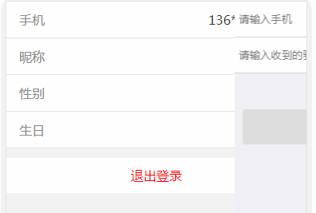
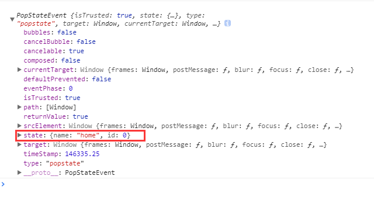
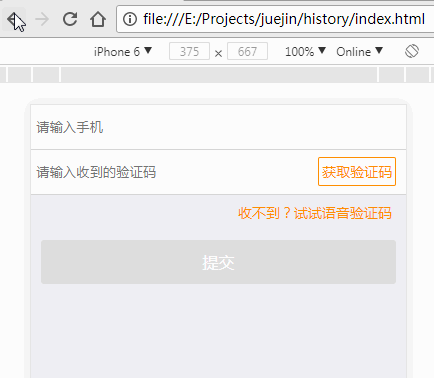
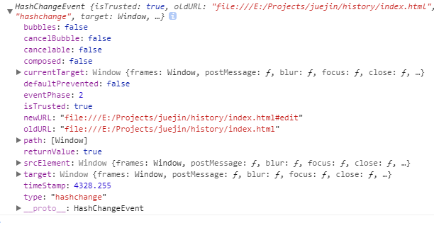
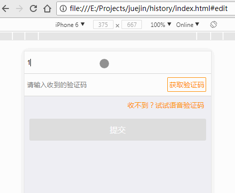

Ajax的流行和前端MVVM框架的快速发展给Web开发带来了极大的便利，也让Web应用体验越来越好，近些年单页应用也随之流行起来。Ajax的应用可以让网页实现无刷新更新数据，但其也会造成浏览器无法前进和后退（浏览器和手机的物理返回键）的问题。早期这个问题通常是借助`iframe`来解决。得益于HTML5，目前有了一些诸如用`pjax`（ajax+pushState）的解决方案。本文要讲解的是如何用`锚点`和`history API`来实现单页面应用页面之间的切换。

讲解之前先说说需求，效果如下图：




需求点：

+ 点击手机信息所在项，从右边划出手机编辑页面

+ 输入手机号码和验证码保存后返回基本信息页面

+ 浏览器点击前进后退可以在两个页面之前切换

+ 支持手机的物理返回键（等价于`history.back()`）

+ 页面需要局部刷新，保持url一致

整个问题的难点应该在于前进和后退的处理，其它的需求以下仅作简单说明。


页面的html主要结构如下：

```html
  <div class="main" id="main">
    <div v-show="!edit" v-cloak>
      <ul class="list">
        <li @click="toggle(1)">
          <label for="">手机</label>
          <div class="list-info">{{showPhone}}</div>
        </li>
        <!-- 其他的基本信息 -->
      </ul>
      <div class="btn">退出登录</div>
    </div>
    <div class="translate" :class="{open: edit}">
        <div class="input-wrap">
          <input type="text" class="input" v-model="phone" placeholder="请输入手机">
        </div>
        <div class="input-wrap">
          <input type="text" class="input" placeholder="请输入收到的验证码" v-model="code">
          <a class="input-btn">获取验证码</a>
        </div>
        <div class="text-right">收不到？试试语音验证码</div>
        <div class="btn btn-submit" @click="toggle(0)" :class="{disabled: !phone || !code}">提交</div>
    </div>
  </div>
```

以上将基本信息页面和编辑页面分别包括在两个同级的`div`标签内。


部分主要的CSS样式如下(未作前缀处理)：

```css
.translate {
  position: fixed;
  top: 0;
  bottom: 0;
  width: 100%;
  background: #efeff4;
  -webkit-transform: translateX(100%);
  -webkit-transition: transform .4s;
}
.translate.open {
  -webkit-transform: translateX(0);
}
```

默认情况下，编辑页面平移至右侧不可见的范围内，当打开编辑页面时，添加`open`类名，使其平移至可见范围内。

接下来，用vue来实现页面的基本的逻辑，。基本的代码如下：

```javascript
var vm = new Vue({
  el: '#main',
  data: {
    edit: false,
    phone: '',
    code: ''
  },
  methods: {
    toggle: function(value){
      //这里处理逻辑
    }
  },
  computed: {
    showPhone: function(){
      return (this.phone || '13688888888').replace(/(\d{3})(\d{4})(\d{4})/, '$1****$3')
    }
  }
});
```

以下通过两种方法来完成以上的需求

### 方法一： 使用history API 来实现

HTML5位history提供了以下API：

+ `window.history.pushState(stateObj, title, url)` : 向当前浏览记录栈中添加一条新的历史记录，添加后页面不会重新加载，参数分别代表：

 > `stateObj`：描述新记录的对象或字符串，方便以后使用，使用`history.state`可以获取，如`{id: 0, name: 'home'}`

 > `title`: 一个字符串，代表页面的标题，目前多数浏览器基本会忽略该参数

 > `url`: 一个字符串，新页面的url地址

+ `window.history.replaceState(stateObj, title, url)`: 与`pushState`一致，不同的是不会往历史栈添加新记录，而是替换当前的浏览记录，常用于落地页。

+ `popstate(e)事件`

当用户点击浏览器的`前进`和`后退`按钮时，就会触发该事件，事件接收一个参数,指向当前历史记录。前面设置的stateObj则是包含于此对象。`e`打印出来格式如下：




有了以上的API，针对需求，实现的思路大致如下：

1. 进入页面后使用`replaceState`替换当前浏览记录，`stateObj`值为`{page: 'home'}`

2. 点击手机编辑后，使用`pushState`往浏览记录记录添加新记录,`stateObj`值为`{page: 'edit'}`,同时为编辑页面添加`open`类，使其进入可视范围

3. 当进行前进和后退时，监听`popstate`事件，并获取当前的`history.state`，通过判断`state.page`的值来实现页面的切换

最终处理的逻辑如下：

```javascript
var vm = new Vue({
  el: '#main',
  data: {...},
  methods: {
    toggle: function(value){
      this.edit = value;//切换页面
      if(value){//如果切换到编辑页面，则添加新的浏览记录
        history.pushState({page: 'edit'},'');
      } else {//从编辑页面回到基本信息页面
        history.back();
      }
    }
  },
  computed: {...}
});
history.replaceState({page:'home'},'' );//进入页面后替换当前浏览记录
window.addEventListener('popstate', function(e){//监听前进和后退
  if (history.state) {
    vm.edit = history.state.page == 'edit';//切换页面
  }
})
```

执行结果如下：



这样子我们就借助`history API`实现了一个简单的单页面页面切换，有了这个基础就可以实现更复杂的应用，如果你还想在页面切换的过程中改变url(这有利于SEO),则可以通过指定`pushState`和`replaceState`的`url`参数来实现。


### 方法二： 使用location.hash(即锚点)

锚点一般用于页面内的快速定位，通过指定锚点，可以使页面跳转至指定元素所在的位置。改变hash值具有不刷新页面的特点。使用锚点来操作浏览器的前进和后退主要用到以下两个：

+ `location.hash`: 获取当前的锚点值，返回空字符串或者如`#detail`格式的值

+ `window.onhashchange`: HTML5新增的事件，用于监听地址的hash值的改变，接收一个回调函数作为参数，回到函数接收接收一个对象，对象的格式如下：



借助`hash`实现我们的需求的基本思路如下：

1. 点击手机编辑后，改变`hash`值为'#edit'

2. 监听`hash`值的变化，通过判断值来控制页面的切换(在这里改变`vm.edit`的值)


因此，完整的代码将变为如下：

```javascript

var vm = new Vue({
  el: '#main',
  data: {...},
  methods: {
    toggle: function(value){
      location.hash = value ? '#edit' : '';
    }
  },
  computed: {...}
  }
});
window.addEventListener('hashchange', function(e){
  vm.edit = location.hash == '#edit';
})

```
在这里例子中，这种方式看起的代码要比使用`history API`的代码简洁

执行结果如下（注意浏览器的地址变化）：




### 总结

以上通过两种方案实现了单页面中页面之前的切换并能够操作浏览器的前进和后退。事实上，`history API`和`location.hash`的应用不仅仅局限与此。除此之外，它们还可以应用于轮播效果、分页、路由等场景。掌握了其使用，结合一些封装，就能用于比较完整的系统中。

### 相关阅读

[pjax相关](https://github.com/welefen/pjax)
[URL锚点HTML定位技术机制、应用与问题](http://www.zhangxinxu.com/wordpress/2013/08/url-anchor-html-%E9%94%9A%E7%82%B9%E5%AE%9A%E4%BD%8D%E6%9C%BA%E5%88%B6-%E5%BA%94%E7%94%A8-%E9%97%AE%E9%A2%98/)


