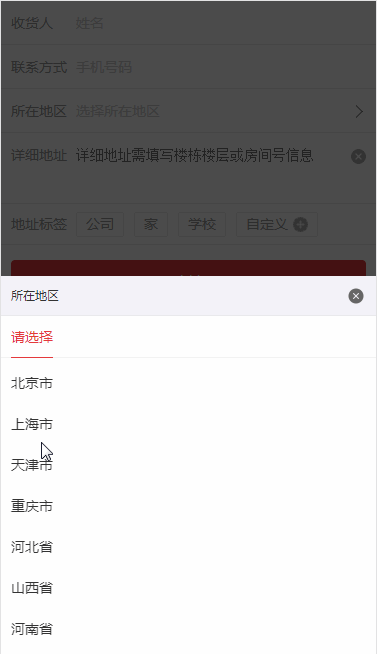
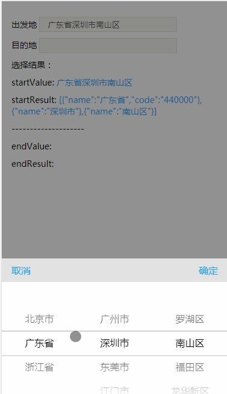
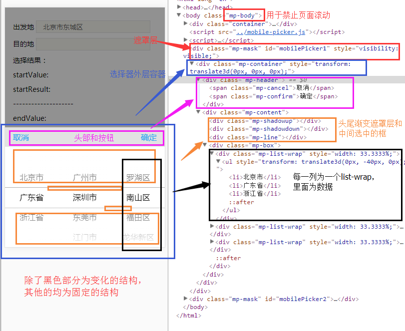
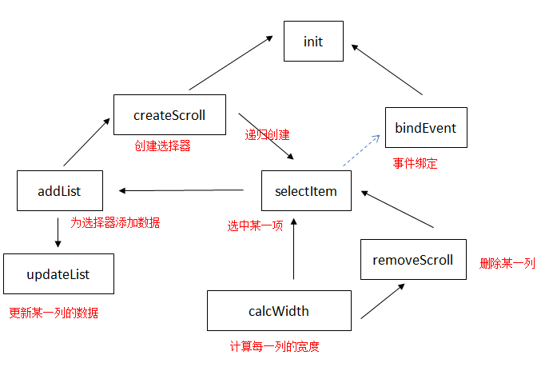
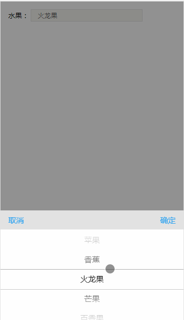
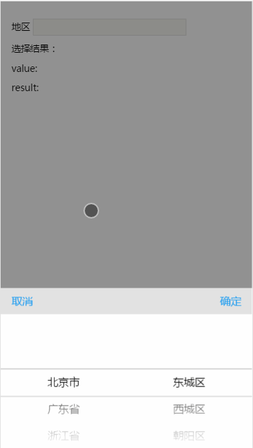
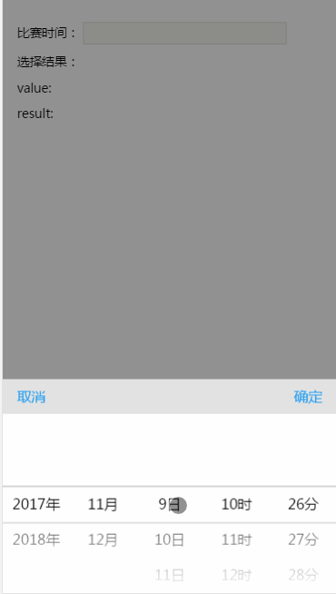
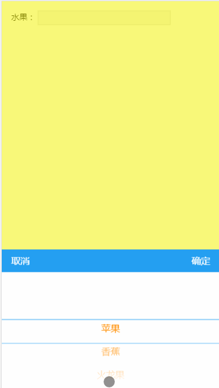

# 一步步打造一个支持异步加载数据的移动端选择器

选择器在应用中是使用比较频繁的一个组件。在移动端，不同的操作系统默认的选择器存在各种差异，iOS为底部滚动的选择器，不同的Android系统，默认的选择器也是不尽相同的。同时，默认的选择器在web应用中定制性也比较差。在实际开发中，针对web应用，我们的需求一般是忽略系统差异，不同的操作系统间，同一个组件的表现形式应该是一致的。另外，我们常常要求选择器可以定制，如支持多级联动，支持标题定制，样式定制和回调等。因此，web应用中的选择器大部分情况需要自己开发组件。目前，关于移动端选择器组件在各大技术社区和github上都有不少的相关的项目，实现的方法和方式也是各式各样。就我个人而言，我比较喜欢的选择器交互方式为类似京东的地区联动选择器，如图：



原因有如下几个（与iOS选择器做比较）:

+ 实现方法简单
+ 可以更好实现真正意义上的无限级联动
+ UI的定制更加灵活，如单行除了显示一个项（京东一行显示一个地址）以外，也可以所有的项紧密排列在一起，这样对于比较多的数据时会显得更清晰，操作更方便；定制样式也会变得更灵活，如数据描述文字的长短控制（在iOS那种交互的选择器下，如果文字过长可能需要做一些如显示省略号的特殊处理
+ 兼容性高，交互的事件更简单

喜欢归喜欢，实际上目前为止，本人接到最多的需求还是设计成仿照iOS选择器的样式，如下：



本文将基于这种交互方式，实现一个仿iOS的选择器，最终效果如上图。类似京东地址选择器的开发核心思路与此相同，甚至要简单一些。

## 需求

+ 支持扁平的数据和嵌套的数据，如`["北京市","上海市","天津市"]`和

```javascript
[{
    name: '北京市',
    code:"110000",
    list: [
      {name: '东城区',code: '110101'},
	  {name: '西城区',code: '110102'},
      {name: '朝阳区',code: '110105'},
      {name: '丰台区',code: '110106'},
      {name: '海淀区',code: "110108"},
      {name: '房山区',code:'110111'}
    ]
 }]

```
+ 支持多级联动选择
+ 支持确认回调，单项选择回调和取消选择回调
+ 支持异步加载数据并动态改变选择器
+ 支持样式定制

## 开发思路

（1） 初始化时先创建必须的dom结构

（2） 遍历传入的数据，创建第一个可以滚动的选择器，并选中第一个（如果有传入默认值，则选择对应的项），选中后如果当前项存在子级列表，则递归创建第二个滚动的选择器，并依次递归创建第三个，第四个...直至不存在子级列表为止

（3）当滑动选择器时，改变选择器的偏移量来选择对应的项，选择结束后一样需要递归创建子级滚动器


## 辅助数据

由于传入的数据可以是扁平的，也可以是嵌套的。在实现过程有部分代码会有不同的处理情况,故以下给出两组数据辅助理解。

```javascript

//扁平的选择数据
var fruit = ["苹果","香蕉","火龙果","牛油果","草莓"];
//城市联动数据
var city = [
  {
    name: '北京市', //name对应实例化时传入的textKey
    code:"110000",
    list: [ //list对应传入的childKey
      {name: '东城区'},
	  {name: '西城区'},
      {name: '朝阳区'},
      {name: '海淀区'}
    ]
  },
  {
    name: '广东省',
    code: "440000",
    list:[
      {
        name: '广州市',
        code: "440100",
        list: [
          {name: '海珠区',code:'440105'},
          {name: '天河区',code: "440106",
           list:[
				{name: '黄埔大道'},
				{name: '中山大道'},
				{name: '华夏路'}
			]
		  }
        ]
      },
      {
        name: '深圳市',
        list: [
			{name: '罗湖区'},
			{name: '南山区'},
			{name: '福田区'},
			{name: '龙华新区'},
			{name: '龙岗区'},
			{name: '宝安区'}
		]
      },
      {name: '东莞市'},
    ]
  }
];

```

## 实现

### html 与 CSS 部分

由于html结构和CSS本身不难也不是重点，这里不做详细的描述和分析，只给出基本的html和在CSS中对应的类名关系说明。详细的代码可以见源码。



图中，黑色框部分为核心的html结构，后面所有的操作都操作这一部分的结构，其它部分实例化不再改变。每增加一个选择器就增加一个`<div class="mp-list-wrap><ul></ul></div>`，通过改变ul的transform属性来实现滚动效果。


### javascript部分

#### 1. 基本的代码结构

```javascript
;(function(global){
  var PICKERCOUNT = 0; //同一个页面可能有多个选择器，用于记录选择器个数
  var body = document.getElementsByTagName("body")[0]; // body元素
  var coordinate = {start: {y:0},end: {y:0,status:true}, move: {y:0}}; //记录手指滑动的坐标
  function Picker(config){} //构造函数
  
  Picker.prototype = {
   constructor: Picker,
   //核心代码
   //...
  }

  if (typeof module !== 'undefined' && typeof exports === 'object') {
     module.exports = Picker;
  } else if (typeof define === 'function' && (define.amd || define.cmd)) {
    define(function() { return Picker; });
  } else {
    global.Picker = Picker;
  }
})(this);

```

#### 2. 工具函数

在实现逻辑时会多次用到同一个操作或计算，我们封装一个Util对象，专门用来处理这部分的逻辑，代码和解释如下:

```javascript
var Util = {
  removeClass: function(el, className) {//删除el元素指定的类
    var reg = new RegExp('(\\s|^)' + className + '(\\s|$)');
    el.className = el.className.replace(reg, ' ').replace(/^\s\s*/, '').replace(/\s\s*$/, '');
  },
  addClass: function(el, className) { //为el元素添加一个类
    !Util.hasClass(el,className) && (el.className += (el.className ? ' ' : '') + className);
  },
  hasClass: function(el, className) { //判断el元素是否有对应的类
    return !!el.className && new RegExp('(^|\\s)' + className + '(\\s|$)').test(el.className);
  },
  loop: function(start,end,handle){ //循环操作
    for(var i = start; i < end; i++){
      Util.isFunc(handle) && handle(i);
    }
  },
  isFunc: function(name){ //判断是否为函数
    return typeof name === 'function';
  },
  isArray: function(o) { // 判断是否为数组
    return Object.prototype.toString.call(o) === '[object Array]';
  },
  isObject: function(o) { // 判断是否为对象
    return typeof o === 'object';
  },
  damping: function (value) {//阻尼运算，用于滚动时的弹性计算
    var steps = [20, 40, 60, 80, 100],rates = [0.5, 0.4, 0.3, 0.2, 0.1];
    var result = value,len = steps.length;
    while (len--) {
      if (value > steps[len]) {
        result = (value - steps[len]) * rates[len];
        for (var i = len; i > 0; i--) {
            result += (steps[i] - steps[i - 1]) * rates[i - 1];
        }
        result += steps[0] * 1;
        break;
      }
    }
    return result;
  },
  //创建元素，参数分别为父级元素，标签名，类名，初始的html内容
  createEle: function(parent, tag, className, html) { 
    var ele = document.createElement(tag);
    className && Util.addClass(ele,className);
    html && (ele.innerHTML = html);
    parent && parent.appendChild(ele);
    return ele;
  },
  getEle: function(ctx, selector) { // 获取元素
    return ctx.querySelector(selector);
  },
  setTransform: function(el,y) { // 设置el元素的translateY
    el.style.transform = 'translate3d(0,'+ y +'px,0)';
  }
}

```

#### 3. 构造函数

构造函数接收传入的配置，包括数据，触发选择器的元素，事件回调以及初始值，子列表的key等，同时要记录当前选择器的索引(通过PICKERCOUNT来计算)。构函数最终的代码如下：

```javascript

function Picker(config){
  this.index = ++PICKERCOUNT;//当前选择器的索引
  this.target = config.target instanceof HTMLElement ? config.target : typeof config.target === "string" ? Util.getEle(document,config.target) : null;//触发选择器的dom元素
  this.data  = config.data || [];//需要显示的数据
  this.value = config.value ? (Util.isArray(config.value) ? config.value : config.value.split(',')) : [];//选择器默认值
  this.childKey = config.childKey || 'child';//子数据索引名
  this.valueKey = config.valueKey || 'value';//用于索引初始值的key
  this.textKey = config.textKey || 'value';//用于显示的key
  this.autoFill = !(config.autoFill === false);//选择确定后是否填充到目标元素
  this.confirm = config.confirm;//确定选择的回调
  this.cancel = config.cancel;//取消回调
  this.initCallback = config.initCallback;//实例化完成的回调
  this.select = config.select;//单个列表选择后的回调
  this.lock = config.lock === true;//锁定确定按钮，用于异步加载时等待使用
  this.className = config.className || '';//定制的类名
  this.init(); //生成各种结构
}

```

#### 4. init方法

init方法用于生成基本的dom结构（上图中非黑色框部分）,生成后递归创建选择器列表，并绑定事件。代码和解析如下：

```javascript
init: function(){
  this.initResult(); //初始化选择器结果
  //基本的dom结构
  var html = '<div class="mp-container"><div class="mp-header"><span class="mp-cancel">取消</span><span class="mp-confirm'+(this.lock ? ' disabled' : '')+'">确定</span></div><div class="mp-content"><div class="mp-shadowup"></div><div class="mp-shadowdown"></div><div class="mp-line"></div><div class="mp-box"></div></div>';
  var container = Util.createEle(body,'div','mp-mask',html);
  // 如果传入了额外的类名，则在外层容器添加类名
  this.className && Util.addClass(container,this.className);
  container.id = 'mobilePicker'+this.index;
  this.container = container;
  this.box = Util.getEle(container, '.mp-box')//用于包含滚动元素的容器
  this.createScroll(this.data);//核心方法：创建滚动的元素
  this.value = []; // 创建完重置传入的默认值，后面的选择器值均为上一次选择的值
  this.bindEvent();//绑定事件
  this.finisInit(); //初始化结束后的回调
}
initResult: function(config){
  this.scrollCount = 0;//已渲染的数据层级数
  this.selectIndex = [];//每个层级选中的索引集合
  this.result = [];//选择器最终的结果
  this.offset = [];//每个层级滚动的偏移量集合
}

```

#### 5. 核心方法

接下来重点看一下以下几个核心方法的实现思路和具体的代码。

+ 思路： 

整个思路的方法调用关系如下图：



在`init`方法创建完基本元素后调用`createScroll`方法，该方法首先创建一个类名为`.mp-list-wrap`的元素，用于包裹接下来要创建的滚动结构，同时为改元素记录一个递增的`scrollIndex`，用于后续定位该元素并更新数据和偏移量等操作；接着调用`addList`方法，遍历传入的data数据，先遍历第一层数据，每遍历一个拼接一个`li标签`并填充数据，如果有传入默认值，则比对当前的值是否与默认值相同，如果相同则记录当前选择列表选中的index为当前索引，否则index为0。拼接完所有的li标签则添加至滚动器，并初始化当前的滚动器偏移量offset为0，紧接着调用`selectItem`方法，传入index参数，选中当前需要选中的列表项。`selectItem`根据传入的index计算出当前选中的结果存储至结果集，并且计算当前滚动器的偏移量，将滚动器滚动至相应的位置。同时，遍历传入的data，根据index判断当前data[index]是否有子级列表数据，如果有，则递归调用`createScroll`方法继续创建下一个选择列表，直至没有子级列表。同时，每次执行选择应该将当前列表以后的列表清除掉（`removeScroll`）或更新(`udpateScroll`)【见下面场景说明】。滚动的列表已经全部创建完成后，再调用`calcWidth`计算每一个scroll的宽度即可。

`init`方法调用完`createScroll`方法后需要调用`bindEvent`方法绑定事件。事件的处理基本也都是在不同的时机调用`createScroll`,`selectItem`以及更新单个scroll的方法等。

关于需要更新和删除scroll的场景说明：
假设当前选择器为一个城市联动选择器，用户第一次选择了**广东省->广州市->天河区->中山大道**。紧接着用户第二次打开选择器，将**广东省**改为了**北京市**,此时属于第一个选择列表，所以第二个选择列表（即广州市所在的列）的数据应该更改为北京市下面的区，通过调用`updateList`来实现，更新后默认选择第一个，如`东城区`。假如此时东城区以下没有子级的数据，那么应该调用`removeScroll`来移除东城区所在列以后的列，即天河区和中山大道所在的列。

+ 详细代码和解析

```javascript
 createScroll: function(data){//创建滚动列表
    var scroll = Util.createEle(this.box,'div','mp-list-wrap','<ul></ul>');//创建一个scroll
    scroll.scrollIndex = this.scrollCount++; //为当前scroll添加索引
    this.addList(Util.getEle(scroll, 'ul'), data); //往scroll添加li元素
 },
 addList: function(parent, data){//添加数据
  var html = '',that = this;
  var index = 0,scrollIndex = parent.parentNode.scrollIndex,text = '';
  Util.loop(0,data.length,function(i){
    text = that.getText(data[i]);//计算要显示的列表项文字
    html += '<li>'+text+'</li>';
    //初始化时有默认值，应该选中当前值，否则index就会为0，即选中第一个
    if(that.value.length && that.value[scrollIndex] && (Util.isObject(data[i]) && data[i][that.valueKey] === that.value[scrollIndex][that.valueKey] || data[i] == that.value[scrollIndex])){
     index = i;
    }
  });
  parent.innerHTML = html;
  this.offset.push(0);//每添加一个需要添加一个偏移量的记录
  this.selectItem(data, index, scrollIndex);//选中并创建下一级选择器
 },
 updateList: function(index,data){//更新某一列的数据
   var dom = this.box.childNodes[index];
   if(!dom){
     this.createScroll(data);
     return;
   }
   dom = Util.getEle(dom,'ul');
   this.addList(dom, data);
 },
 removeScroll: function(index){//移除某一列
   var that = this;
   var node = this.box.childNodes[index];
   if(node){
     this.box.removeChild(node);
     this.scrollCount--;//移除后当前的列数量要减1
     this.calcWidth(); //重新计算每一列的宽度
   }
 },
 selectItem:function(data, index, scrollIndex){//params: 数据，选中的索引，当前scroll的索引
  var that = this;
  var oldScrollCount = this.scrollCount;//记录当前的列数
  this.selectIndex.length = this.result.length = scrollIndex + 1; //重置结果集的长度
  this.selectIndex[scrollIndex] = index;//记录当前列选中的索引
  this.result[scrollIndex] = this.setResult(data[index]); //记录当前列选中的结果（去除子列表）
  this.setOffset(scrollIndex, index); //  将当前列滚动至选择的位置
  if(data[index] && data[index][that.childKey] && Util.isArray(data[index][that.childKey]) && data[index][that.childKey].length){//存在子级列表
    if(that.scrollCount < scrollIndex + 2){//如果上一次的列数少于当前需要的列数，则创建一个新的列
      that.createScroll(data[index][that.childKey]);
    }   else { // 目前已有的列数不小于当前需要的列数，则更新对应的列的数据
      that.updateList(scrollIndex + 1, data[index][that.childKey]);
    }
  } else {//说明当前的已有的列数目多于需要的，移除多余的
    for ( var j = oldScrollCount - 1, len = that.selectIndex.length; j >= len; j-- ) {//删除多余的ul
      that.removeScroll(j);
    }
  }
 this.offset.length = this.selectIndex.length;//重置偏移量结果集的长度
 this.calcWidth();//计算每一列的宽度
 Util.isFunc(that.select) && that.select(scrollIndex,this.result,index,data[index] && data[index][that.childKey] && Util.isArray(data[index][that.childKey]) && data[index][that.childKey].length); //执行单列选择回调，一般用于异步请求数据
},
 bindEvent: function(){//事件绑定
   var that = this;
    that.target.disabled = true;
    ['touchstart','touchend','touchmove'].forEach(function(action){
        that.box.parentNode.addEventListener(action,function(event){
        event = event || window.event;
        event.preventDefault();
        var target  = event.target;
        var index = target.parentNode.scrollIndex;
        var child = target.childNodes;
        var liHeight = child[child.length - 1].offsetHeight;
        var scrollHeight = child[child.length - 2].offsetTop;
        if(target.tagName.toLowerCase() != 'ul') return;
        switch(action) {
          case 'touchstart':
            if(coordinate.end.status){
              coordinate.end.status = !coordinate.end.status;
              coordinate.start.y = event.touches[0].clientY;
              coordinate.start.time = Date.now();
            }
            break;
          case 'touchmove':
            coordinate.move.y = event.touches[0].clientY;
            var distance = coordinate.start.y - coordinate.move.y;
            var os = distance + that.offset[index];
            if(os < 0){//已经滑到最顶部
              Util.setTransform(target, Util.damping(-os));
            } else if(os <= scrollHeight){
              Util.setTransform(target, -os);
            } else {//超过了整体的高度
              Util.setTransform(target, -(scrollHeight + Util.damping(os-scrollHeight)));
            }
            break;
          case 'touchend': //停止滚动后计算应该选择的项
            coordinate.end.y = event.changedTouches[0].clientY;
            var count = Math.floor((that.offset[index] + (coordinate.start.y - coordinate.end.y))/liHeight + 0.5)
            count = count < 0 ? 0 : Math.min(count, target.childNodes.length - 1);
            var temp = that.offset[index];
            that.offset[index] = count < 0 ? 0 : Math.min(count * liHeight,target.offsetHeight - 5 * liHeight)
            Util.setTransform(target, -that.offset[index]);
            coordinate.end.status = true;
            that.selectIndex.length  = index + 1;
            that.selectIndex[index] = count;
            that.selectItem(that.getData(that.selectIndex),count,index);
            break;
        }
      },false)
    });
    that.target.addEventListener('touchstart',function(event){
      (event || window.event).preventDefault();
	   //记录旧结果，用于取消恢复
      that.oldResult = that.result.slice(0);
      that.update({//由于更新整个选择器
        value: that.result,
        valueKey: that.textKey
      });
      that.show();
    });
    //  用click事件代替touchstart防止点透
    Util.getEle(that.container,'.mp-cancel').addEventListener('click',function(){
      that.hide();
	  //恢复旧的结果,update方法见后面的接口方法
      that.update({
        value: that.oldResult,
        valueKey: that.textKey
      });
      Util.isFunc(that.cancel) && that.cancel();
    },false);
    Util.getEle(that.container,'.mp-confirm').addEventListener('click',function(){
      if(that.lock) return;
      var value = that.fillResult(); //计算最终的选择结果
      that.hide();
      Util.isFunc(that.confirm) && that.confirm(value, that.result);
    });
  }

```

+ 其他辅助代码

```javascript
 hide: function(){//关闭选择器
    var that = this;
    Util.getEle(this.container,'.mp-container').style.transform = 'translate3d(0,100%,0)';
    Util.removeClass(body, 'mp-body');
    setTimeout(function(){
      that.container.style.visibility = 'hidden';
    },250)
  },
  show: function(){ //显示选择器
    var that = this;
    that.container.style.visibility = 'visible';
    Util.addClass(body, 'mp-body');
    setTimeout(function(){
      Util.getEle(that.container,'.mp-container').style.transform= 'translate3d(0,0,0)';
    },0)
  },
  fillContent: function(content){ //填充最终选择的数据到触发的元素
    var tagName  = this.target.tagName.toLowerCase();
    if(['input','select','textarea'].indexOf(tagName) != -1) {
      this.target.value = content;
    } else {
      this.target.innerText = content;
    }
  },
  fillResult: function(){ //计算最终结果
    var value = '';
      for(var i = 0,len = this.result.length; i < len; i++){
        if(Util.isObject(this.result[i])){ //如果是嵌套的数据，则根据textKey来拼接
          this.result[i][this.textKey] && (value += this.result[i][this.textKey]);
        } else { //扁平的数据则直接拼接
          value += this.result[i];
        }
      }
      this.autoFill && this.fillContent(value); //选择后需要自动填充则填充数据
      return value;
  },
  getText: function(data){ //每一项要显示的文字，分扁平数据和嵌套数据两种情况
    return Util.isObject(data) ? data[this.textKey] : data;
  },
  finisInit: function(){//初始化完成后内部调用的方法
    var value = this.fillResult();
    Util.isFunc(this.initCallback) && this.initCallback(value,this.result);
  },
  setOffset: function(scrollIndex, index){ //设置偏移量
    var scroll = this.box.childNodes[scrollIndex].querySelector('ul');
    var offset = scroll.childNodes[0] ? scroll.childNodes[0].offsetHeight * index : 0;
    Util.setTransform(scroll, -offset)
    this.offset[scrollIndex] = offset;
  },
 setResult: function(data){ //去除子级列表，计算每一列选择的结果
    if(!Util.isObject(data)) return data;
    var temp = {};
    for(var key in data){
      key != this.childKey && (temp[key] = data[key]);
    }
    return temp;
  },
 getData: function(indexes){//根据一组所以深度遍历数据，获取数据当前需要添加的集合
    var arr = [];
    for(var i = 0; i < indexes.length; i++){
      arr = i == 0 ? this.data : arr[indexes[i -1]][this.childKey];
    }
    return arr;
 }

```

#### 6. 接口方法

由于选择器需要支持异步加载数据，则需要在某些时机操作和动态的更新选择器，因此需要提供一些接口方法供异步加载时使用。其中上面的`removeScroll`，`addList`以及`updateScroll`均可作为接口方法。除此之外还需要提供以下方法：

```javascript
/*传入新的数据，更新整个选择器
该方法相当于重新初始化选择器，仅仅只是省去了创建基本dom接口和事件绑定的过程
*/
update: function(options){ 
  for(var i in options) {
    this[i] = options[i];
  }
  this.initResult()
  this.box.innerHTML = '';
  this.createScroll(this.data);
  this.value = [];
}, 
/* 更新某一列的数据，一般用于联动时加载下一级数据
@param: index 要更新的列索引
@param: data 要更新的数据集合
@pramg: value 默认选中的值
@param: callback 更新后的回调函数
*/

setScroll: function(index,data,value,callback) {
  value && (this.value[index] = value);
  this.offset.length = this.selectIndex.length = this.result.length = this.selectIndex.length = index;
  if(index == 0){
    this.data = data;
  } else {
    var temp = this.data[this.selectIndex[0]];
    for(var i = 1, len = index; i < len; i++){
      temp = temp[this.childKey][this.selectIndex[i]];
   }
    temp && (temp[this.childKey] = data); //更新data里对应的数据
  }
  this.updateList(index,data);
  this.value = [];
  Util.isFunc(callback) && callback(index,this.result);
},
 setLock: function(value){ //锁定或者解锁确定按钮，一般用于请求数据时的等待，以保证数据的完整性
    var confirm = Util.getEle(this.container,'.mp-confirm'),old = this.lock;
    this.lock = value !== false;
    if(old !== this.lock) {
      this.lock ? Util.addClass(confirm,'disabled') : Util.removeClass(confirm, 'disabled');
    }
  },


```

## 实例

以下所有实例点击标题可以在移动端预览效果，你可以在手机端点击标题或者用手机扫描二维码预览。

+ [一个最简单的实例](https://prianyu.github.io/mobile-picker/demo/fruit.html)


```html
<div class="container">
 <label for="">水果：</label>
 <input type="text" id="fruit">
</div>

```

```javascript 
var fruit = ['苹果','香蕉','火龙果','芒果','百香果'];
new Picker({
  target: '#fruit',
  data: fruit,
  value: '火龙果' //默认值
});

```

效果如下：



+ [一个城市联动实例](https://prianyu.github.io/mobile-picker/demo/city.html)


这是一个综合实例，包含的内容有：嵌套的数据传默认值，自动填充和自定义填充，一个页面有多个选择器，`childKey`,`valueKey`,`textKey`,`initCallback`,`confirm`等的使用。


**html:**

```html

<div class="container">
    <div>
      <label for="">出发地</label>
      <input type="text" id="start">
    </div>
    <div>
      <label for="">目的地</label>
      <input type="text" id="end">
    </div>
    <div class="print">
      <div>选择结果：</div>
      <div>startValue: <span id="startValue"></span></div>
      <div>startResult: <span id="startResult"></span></div>
      <div style="margin: 10px 0">--------------------</div>
      <div>endValue: <span id="endValue"></span></div>
      <div>endResult: <span id="endResult"></span></div>
    </div>
 </div>

```
**data的基本格式:**

```javascript
var city = [
  {
    name: '北京市',
    code:"110000",
    list: [
      {name: '东城区'},
      {name: '丰台区'},//...
    ]
  },
  {
    name: '广东省',
    code: "440000",
    list:[
      {
        name: '广州市',
        code: "440100",
        list: [
          {name: '海珠区',code:'440105'},
          {name: '天河区',code: "440106",
		   list:[
				{name: '黄埔大道'},
 				{name: '中山大道'},
				{name: '华夏路'}
		  ]}
        ]
      },
      //...
    ]
  }
 //...
 
];

```

**逻辑代码:**

```javascript

new Picker({
  target: document.getElementById('start'),//直接传入dom元素
  data: city,
  textKey: 'name', //用于显示的key
  valueKey: 'name', //用于关联默认值的key
  childKey: 'list', //子数据列表的key
  value: [{name: '广东省'},{name: '深圳市'},{name: '南山区'}], //默认值
  confirm: function(value,result){ //确定选择的回调
    document.getElementById('startValue').innerText = value;
    document.getElementById('startResult').innerText = JSON.stringify(result);
  },
  initCallback: function(value,result) { //初始化结束后的回调
    document.getElementById('startValue').innerText = value;
    document.getElementById('startResult').innerText = JSON.stringify(result);
  }
});
new Picker({
  target: '#end',
  data: city,
  textKey: 'name',
  autoFill: false, //不自动填充
  childKey: 'list',
  confirm: function(value,result){
    document.getElementById('endValue').innerText = value;
    document.getElementById('endResult').innerText = JSON.stringify(result);
    //结果处理后再显示
    var text = [];
    for(var i = 0; i < result.length; i++){
      text.push(result[i].name);
    }
    this.target.value = text.join('-');//this.target取得当前的目标元素，并自定义填充
  }
});

```

效果如下：


+ [一个异步加载数据的例子](https://prianyu.github.io/mobile-picker/demo/async.html)


其中html结构与上面的城市联动结构一致，不同的是，这次，第三级以后的数据(`如天河区等`)采用异步加载的方法来获取。思路是：当选择一个列后,调用`select`回调，如果当前没有下一级数据则需要异步加载，加载时通过`setLock`方法锁定确定按钮，不让点击，以保证数据的完整性。同时，调用`setScroll`方法预先添加一个空白列，待数据返回后，如果有子级列表，则再调用`setScroll`方法更新当前列的数据，否则，调用`removeScroll`方法移除预先添加的列。完成后，再调用`setLock`方法解锁确定按钮。

```javascript
function getDistrict(code){
  var data = {
    "code_440330" : [{name: '罗湖区'},{name: '南山区'},{name: '福田区'},{name: '龙华新区'},{name: '龙岗区'},{name: '宝安区'}],
    "code_440100": [{name: '海珠区',code:'440105'},{name: '天河区',code: "440106",list:[{name: '黄埔大道'},{name: '中山大道'},{name: '华夏路'}]}],
    "code_440700":  [{name: '台山市'},{name: '鹤山市'},{name: '开平市'},{name: '新会区'},{name: '恩平市'}],
    "code_330100": [{name: '桐庐县'},{name: '江干区'},{name: '西湖区'},{name: '下城区' }],
    "code_330200": [{name: '江东区'},{name: '江北区'},{name: '高新区'},{name:'海曙区'},{name: '象山区'},{name:' 慈溪市'}]
  }
  return data['code_'+code] || [];
}
var picker = new Picker({
    target: '#area',
    data: city,
    textKey: 'name',
    childKey: 'list',
    confirm: function(value, result){
      var str = [];
      for(var i = 0, len = result.length; i < len; i++){
        str.push(result[i].name);
      }
      this.target.value = str.join('-');
      document.getElementById('value').innerText = value;
      document.getElementById('result').innerText = JSON.stringify(result)
    },
    select: function(scrollIndex,result,index,haschild){
      var city = result[scrollIndex];//获取结果集中的当前项
      var that = this;
      //当选择的不是城市级别或者选择的是直辖市或者当前选择的城市已有子级列表（没有的在请求后会被缓存）则不做操作
      if(scrollIndex !== 1 || "11|12|31|50".indexOf(city.code.substring(0, 2)) >= 0 || haschild) return;
      this.setScroll(scrollIndex + 1, []);//创建空白的下一级选择器，之所以这样做是防止页面抖动
      that.setLock(true);//因为是异步请求，数据没返回之前锁定选择器,请留意效果图中的确定按钮
      setTimeout(function(){//这里模拟一个1秒钟的异步请求
        var data = getDistrict(city.code);//拿到异步数据
        if(data.length){
          that.setScroll(scrollIndex + 1, data);//更新下一级选择器的数据
        } else {
          that.removeScroll(scrollIndex + 1);//没有数据，则移除之前防止抖动的选择器
        }
        that.setLock(false);//请求完毕，解锁
      },1000)
    }
 })
```

效果如下： 



+ [自定义样式例子](https://prianyu.github.io/mobile-picker/demo/style.html)以及[时间选择器例子](https://prianyu.github.io/mobile-picker/demo/datetime.html)


时间选择器

自定义样式

这两个例子这里不放代码。其中自定义样式比较简单，[源码可以看这里](https://github.com/prianyu/mobile-picker/blob/gh-pages/demo/style.html)。而时间选择器是一种特殊的选择器，选择器的数据基本可以通过计算得到而不需要额外传入，同时，配置项也有所差异，所以，时间选择器更适合写一个独立的选择器，后续我会在github上加上独立的时间选择器。当前时间选择器的例子的源码比较啰嗦同时还会造成界面抖动，[源码可以查看这里查看](https://github.com/prianyu/mobile-picker/blob/gh-pages/demo/datetime.html)。两个例子的效果如下)：






## 总结

无论是实现其他交互类型的选择器还是实现仿iOS的选择器，实现的方式都各式各样。如果在实际的应用只是有一处用到了选择器，那应该没有必要去专门封装一个通用的选择器，直接按需写一个仅仅满足需求反而会简单和快捷一些。本文提供一个封装选择器的思路，供大家一起学习和探讨，欢迎反馈问题。本文所有源码和使用的文档均在github上，有兴趣的可以fork下来继续完善，[点击这里查看](https://github.com/prianyu/mobile-picker)。


