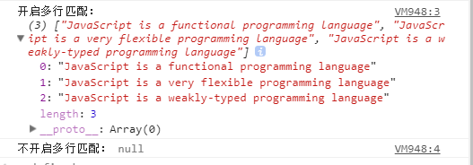

### 常用字符类元字符


+ `[abc]` 和 `[^abc]` : 字符集合和反向字符集合。其中abc为任意数量任意字符的集合，也可以指定一个范围，如`[a-f1-9]`等价于`[abcdef123456789]`。字符集合匹配包含指定范围内的字符的文本，反向字符集合匹配不包含指定范围内的字符的文本。

```javascript
var reg1 = /[abcxyz]/,
	reg2 = /[^abcxyz]/;

reg1.test("food");//结果为false
reg1.test("zoom");// 结果为true
reg2.test("food");//结果为true
reg2.test("zoom");//结果为false

```
+ `\d`与`\D`: 分别匹配数字类字符（`即0-9`）和非数字类字符，两者分别等价于字符集合`[0-9]`和 反向字符集合`[^0-9]`

```javascript
//匹配一个一个135开头的手机号（后面有更好的方式）
var reg1 = /135\d\d\d\d\d\d\d\d/;
var reg2 = /\D/;
reg1.test("My phone number is 13500000000.");// 结果为true
reg2.test("13500000000");// 结果为false

```

+ `\w`和`\W`: 其中`\w`匹配任意的字母，数字和下划线_,`\W`与之相反，分别等价于`[a-zA-Z_0-9]` 和 `[^a-zA-Z_0-9]`

```javascript
var value = document.getElementById("password").value;
if(/\W/.test(value)) {
 alert("密码不能包含特殊字符")
}
```

+ `\n`,`\r`,`\f`,`\t`,`\v` : 不可见符，分别为换行符，回车符，分页符，制表符和垂直制表符

+ `\s` 和 `\S` ： 其中`\s`匹配空白符，即空格和上面列举的不可见符号，等价于`[ \n\r\f\t\v]`。而`\S`则等价于 `[^ \n\r\f\t\v]`。**（注意集合的前面有个空格符）**

+ `.` ： 匹配除任意`\n`外的任意单个字符。

```javascript
//匹配以b开头，k结尾的四个字符组成的单词
var reg = /b**k/;
reg.test("Read a book a week.");//因为包含book，所以结果为true
reg.test("Long time no see!");//因为不包含b开头k结尾的单词，所以结果为false

```
**提问：如果要匹配任意的字符包含\n怎么办？**

方法有很多，如`[\s\S]`,`[\w\W]`。 

### 量词类元字符

量词类的元字符用于限定匹配字符的数量，一般紧跟在匹配字符的后面。正则里常见的数量限定元字符主要为以下几个：

`*` : 表示任意数量，可以为0
`+` : 表示一个或者多个
`?` : 表示0个或者一个
`{n}`: n为非负整数，表示正好匹配n个，如以上例子中配135开头的手机号可定义为`/135\d{8}/`
`{n,m}`: n,m均为非负整数且m>=n，当m=n时，等价于`{n}`。表示配置n-m个字符，**需要注意的是逗号和数字之间不能有空格**
`{n,}`: 指匹配n个以上的字符

```javascript
//匹配一个格式为3位或4位区号+6至8位的号码的电话号码，其中区号和号码之间可以有空格或-分割
var phone = /\d{3,4}[-\s]?\d{6,8}/;
var code1 = /coder*/,
	code2 = /coder+/,
	code3 = /coder?/;

phone.test("0201234567");//true
phone.test("020-1234567");//true
phone.test("020 12345678");//true
phone.test("020-12345");//false
phone.test("020 -1234567");//false
phone.test("(020)1234567");//false

//虽然这里号码有9位，但匹配时前匹配到8为止符合正则规则，所以返回true
//此处证明这个正则是有缺陷的，后面继续完善
phone.test("020-123456789");//true

// *:任意数量r
code1.test("code");//true
code1.test("coder");//true
code1.test("coderrrr");//true 

// +:一个以上的r
code2.test("code");//false
code2.test("coder");//true
code2.test("coderrrr");//true

// ?:0或1个r
code3.test("code");//true
code3.test("coder");//true
code3.test("coderrrr");//false

```

### 转义字符

由于有些字符（`如*,+,?,.等`）被定义为了元字符，如果要匹配这些字符的话需要将字符进行转义，转义字符用`\`。如：

```javascript
var str = "1+1";
var reg1 = /1+1/, reg2 = /1\+1/;
reg1.test(str); // false
reg2.test(str); // true

```

### 模式匹配符

模式修饰符使用的格式为`/exp/pattern`，其中pattern即为修饰符，可以为一个或者多个修饰符同时出现。主要有以下三个修饰符：

`i`: 忽略大小写，添加该修饰符后，正则匹配将忽略大小写，如`/ab/i`匹配AB,AB,aB,Ab和ab.

`g`: 全局匹配，默认情况下，当匹配一次成功后，正则便停止匹配，如开启全局匹配，正则将会多次匹配并返回结果。如：

```javascript
var reg = /can/i,
	greg = /can/ig;
var str = 'Can you can a can as a caner can can a can?';

console.log('不开启全局搜索：',str.match(reg));
console.log('开启全局搜索：',str.match(greg));

```
结果如下：


从结果可以发现，在javascript中，使用match方法时，返回结果根据是否开启全局搜索模式返回不同的格式和内容，当不开启全局搜索时，正则第一次匹配成功后即结束，返回结果中，索引0对应的为匹配的结果字符串，input为输入原始文本，index为匹配的结果在原始文本的位置;当开启了全局搜索时，结果为匹配的结果数组。（如果从头到尾没有匹配到则均返回null）

`m`:多行匹配模式。默认情况下，定界符（位置元字符，见下文）`^`和`$`分别匹配文本的开始位置和结束位置。开启多行模式后，它们将分别匹配任意一行的行首和行位，而不是整个文本的开头和结尾。

```javascript

var str = "JavaScript is a functional programming language\rJavaScript is a very flexible programming language\nJavaScript is a weakly-typed programming language";
var reg = /^Javascript .* language$/img,reg2 = /^javascript .* language$/ig
console.log("开启多行匹配：",str.match(reg));
console.log("不开启多行匹配：",str.match(reg2));

```

结果如下：



可以看到，开启多行模式后，正则的开头和结尾将定义为每行的行首和行尾。而为开启多行模式匹配失败（因为`.`匹配换行符外的任意字符，而文本中包含换行符,如果需要匹配，可以将reg2改为`/^javascript [\s\S]* language$/ig`）


### 位置元字符

位置元字符用来匹配一个位置，用于边界匹配。主要有以下几个：

`^`： 匹配文本的开头位置，如`/^a.*/`匹配以a开头的任意文本

`$`: 匹配文本的结尾位置，如`/er$/` 匹配以er结尾的文本

`\b`和`\B`： 匹配单词的边界和非单词边界

```javascript
var str = "Lucy like dancing,singing and drawing";
var reg1 = /\bsing\b/,
	reg2 = /sing/,
	reg3 = /\blike\b/
	reg4 = /\Blike\B/;
reg1.test(str); //false
reg2.test(str); //true
reg3.test(str); //true
reg4.test(str); //false
	
```

以上几个比较简单，除此之外还有以下几个名称贼绕，但是十分有用的元字符，成为`零宽断言`。许多复杂和高级的正则表达式都离不开这几个元字符（如匹配嵌套的html标签）。在理解时，可以类似\b和\B去分析。不同的是\b和\B是用单词分隔符作为匹配条件，而零宽断言的匹配条件是用exp来作为界定。其匹配的是一个位置，不消费字符，匹配成功的结果为去除exp的那一部分的内容。

`(?=exp)` : 零宽度正预测先行断言,用于匹配exp前面的位置，其匹配成功的条件是：匹配的文本后面还需要匹配到exp。如`/\b\w+(?=ing)/b/`这个正则匹配的条件：首先它是一个单词（`\b`）,其次，这个单词必须后面还需要匹配到`ing`,即正则的结果匹配任何以`ing`结尾的单词去掉`ing`那一部分，如singing,reading匹配的结果是'sing'和'read'，而单独的'sing'和'read'将匹配失败。

`(?<=exp)`: 零宽度正回顾后发断言，用于匹配exp后面的位置，其匹配成功的条件是：匹配的文本前面还需要匹配到exp。如`/\b(?<=un)\w+\b/`将匹配以un开头的单词去除un后的那一部分，即单词'unbelievable'将匹配成功，结果为'believable'，而单词'comfortable'将匹配失败。

`(?!exp)`: 零宽度负预测先行断言，匹配exp前面的位置，其匹配成功的条件是： 匹配文本后面紧跟的不是exp。如匹配包含字母z的单词（不区分大小写），但不能是'zoo'，'zoom'等后面接着'oo'的单词的正则为： `/\b[a-z]*z(?!oo)[a-z]*\b/i`


`(?<!exp)`: 零宽度负回顾后发断言，用于匹配exp后面的位置，其匹配成功的条件是： 匹配的文本前面不能匹配到exp。如匹配前面没有字母的一串7位数字`(?<![a-z])\d{7}`

### 分支与分组捕获

> 分支

有时候一个文本只要满足几种规则中的一种则匹配成功，如匹配所有以'boo'或'zoo'开头的单词。这种匹配条件即为分支条件。在正则中用管道符`|`来表示分支

`x|y`: 匹配x或者匹配y

在上面的例子中，我们匹配一个电话号码最终的正则是`/\d{3,4}[-\s]?\d{6,8}/`。这个正则能匹配**0208888888**和**020-8888888**等格式的电话号码，但是**(020)8888888**和**(202)-8888888**这种合法的电话号码会匹配失败。如果要支持这种格式的电话号码，则匹配区号的正则应该包含或者不包含一个**完整的括号**。同时没有区号也是一个合法的电话号码。因此，正则应该为：

+ 区号： `(\d{3,4})|\d{3,4}`,因为可有可无，所以完善为`((\d{3,4})|\d{3,4})?`。同时由于括号为正则的特殊符号，因此区号中的括号需要转义`(\(\d{3,4}\)|\d{3,4})?`

+ 电话号码： `\d{6,8}`

另外，如果这是在做表单验证，则还应限定前后不能有其他字符，因此最终的正则表达式为：
`/(\(\d{3,4}\)|\d{3,4})?\d{6,8}/`

> 分组与捕获

将一组字符划分为一组，匹配时，会为每个匹配到的分组分配一个组号或组名，成为分组；在匹配结果中通过`$组号`或`${组名}`获得对应的匹配结果称为捕获，而如果再匹配的过程中利用`\组号`和`\k<组名>`的方式再次匹配同一个分组，称为反向引用。

`(exp)` : 匹配exp并捕获结果

`(?<name>exp)`: 为该分组命名为name，在捕获或反向引用时，使用`\k<name>`进行反向应用，`${name}`捕获内容

`(?:exp)`: 剥夺该组分配组号的权利，即不为改组分配组号

```javascript
var date = "2018年12月10日";
var dateReg =  /(\d{4}).*(\d{2}).*(\d{2}).*/,
	dateRegName = /(?<year>\d{4}).*(?<month>\d{2}).*(?<date>\d{2}).*/,
	dateReg3 = /(?:\d{4}).*(\d{2}).*(\d{2}).*/
console.log(date.replace(dateReg,"$1-$2-$3")); // 2018-12-10
console.log(date.replace(dateRegName,"$1/$2/$3")) //2018/12/10,javascript不支持${year}的形式？
console.log(date.replace(dateReg3,"$1-$2-$3")); // 12-10-$3, 由于年份没有分配组号

```

> 平衡组


### 贪婪匹配和非贪婪匹配


### 几个应用


## 总结
