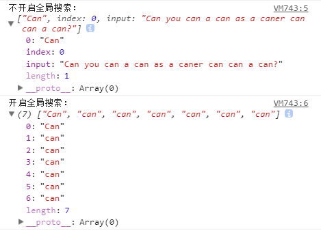

### 常用字符类元字符


+ `[abc]` 和 `[^abc]` : 字符集合和反向字符集合。其中abc为任意数量任意字符的集合，也可以指定一个范围，如`[a-f1-9]`等价于`[abcdef123456789]`。字符集合匹配包含指定范围内的字符的文本，反向字符集合匹配不包含指定范围内的字符的文本。

```javascript
var reg1 = /[abcxyz]/,
	reg2 = /[^abcxyz]/;

reg1.test("food");//结果为false
reg1.test("zoom");// 结果为true
reg2.test("food");//结果为true
reg2.test("zoom");//结果为false

```
+ `\d`与`\D`: 分别匹配数字类字符（`即0-9`）和非数字类字符，两者分别等价于字符集合`[0-9]`和 反向字符集合`[^0-9]`

```javascript
//匹配一个一个135开头的手机号（后面有更好的方式）
var reg1 = /135\d\d\d\d\d\d\d\d/;
var reg2 = /\D/;
reg1.test("My phone number is 13500000000.");// 结果为true
reg2.test("13500000000");// 结果为false

```

+ `\w`和`\W`: 其中`\w`匹配任意的字母，数字和下划线_,`\W`与之相反，分别等价于`[a-zA-Z_0-9]` 和 `[^a-zA-Z_0-9]`

```javascript
var value = document.getElementById("password").value;
if(/\W/.test(value)) {
 alert("密码不能包含特殊字符")
}
```

+ `\n`,`\r`,`\f`,`\t`,`\v` : 不可见符，分别为换行符，回车符，分页符，制表符和垂直制表符

+ `\s` 和 `\S` ： 其中`\s`匹配空白符，即空格和上面列举的不可见符号，等价于`[ \n\r\f\t\v]`。而`\S`则等价于 `[^ \n\r\f\t\v]`。**（注意集合的前面有个空格符）**

+ `.` ： 匹配除任意`\n`外的任意单个字符。

```javascript
//匹配以b开头，k结尾的四个字符组成的单词
var reg = /b**k/;
reg.test("Read a book a week.");//因为包含book，所以结果为true
reg.test("Long time no see!");//因为不包含b开头k结尾的单词，所以结果为false

```
**提问：如果要匹配任意的字符包含\n怎么办？**

方法有很多，如`[\s\S]`,`[\w\W]`。 

### 量词类元字符

量词类的元字符用于限定匹配字符的数量，一般紧跟在匹配字符的后面。正则里常见的数量限定元字符主要为以下几个：

`*` : 表示任意数量，可以为0
`+` : 表示一个或者多个
`?` : 表示0个或者一个
`{n}`: n为非负整数，表示正好匹配n个，如以上例子中配135开头的手机号可定义为`/135\d{8}/`
`{n,m}`: n,m均为非负整数且m>=n，当m=n时，等价于`{n}`。表示配置n-m个字符，**需要注意的是逗号和数字之间不能有空格**
`{n,}`: 指匹配n个以上的字符

```javascript
//匹配一个格式为3位或4位区号+6至8位的号码的电话号码，其中区号和号码之间可以有空格或-分割
var phone = /\d{3,4}[-\s]?\d{6,8}/;
var code1 = /coder*/,
	code2 = /coder+/,
	code3 = /coder?/;

phone.test("0201234567");//true
phone.test("020-1234567");//true
phone.test("020 12345678");//true
phone.test("020-12345");//false
phone.test("020 -1234567");//false
phone.test("(020)1234567");//false

//虽然这里号码有9位，但匹配时前匹配到8为止符合正则规则，所以返回true
//此处证明这个正则是有缺陷的，后面继续完善
phone.test("020-123456789");//true

// *:任意数量r
code1.test("code");//true
code1.test("coder");//true
code1.test("coderrrr");//true 

// +:一个以上的r
code2.test("code");//false
code2.test("coder");//true
code2.test("coderrrr");//true

// ?:0或1个r
code3.test("code");//true
code3.test("coder");//true
code3.test("coderrrr");//false

```

### 模式匹配符

模式修饰符使用的格式为`/exp/pattern`，其中pattern即为修饰符，可以为一个或者多个修饰符同时出现。主要有以下三个修饰符：

`i`: 忽略大小写，添加该修饰符后，正则匹配将忽略大小写，如`/ab/i`匹配AB,AB,aB,Ab和ab.

`g`: 全局匹配，默认情况下，当匹配一次成功后，正则便停止匹配，如开启全局匹配，正则将会多次匹配并返回结果。如：

```javascript
var reg = /can/i,
	greg = /can/ig;
var str = 'Can you can a can as a caner can can a can?';

console.log('不开启全局搜索：',str.match(reg));
console.log('开启全局搜索：',str.match(greg));

```
结果如下：



从结果可以发现，在javascript中，使用match方法时，返回结果根据是否开启全局搜索模式返回不同的格式和内容，当不开启全局搜索时，正则第一次匹配到后即结束，返回解果中，索引0对应的为匹配的结果字符串，input为输入原始文本，index为匹配的结果在原始文本的位置;当开启了全局搜索时，结果为匹配的结果数组。（如果从头到尾没有匹配到则均返回null）

`m`:多行匹配。


